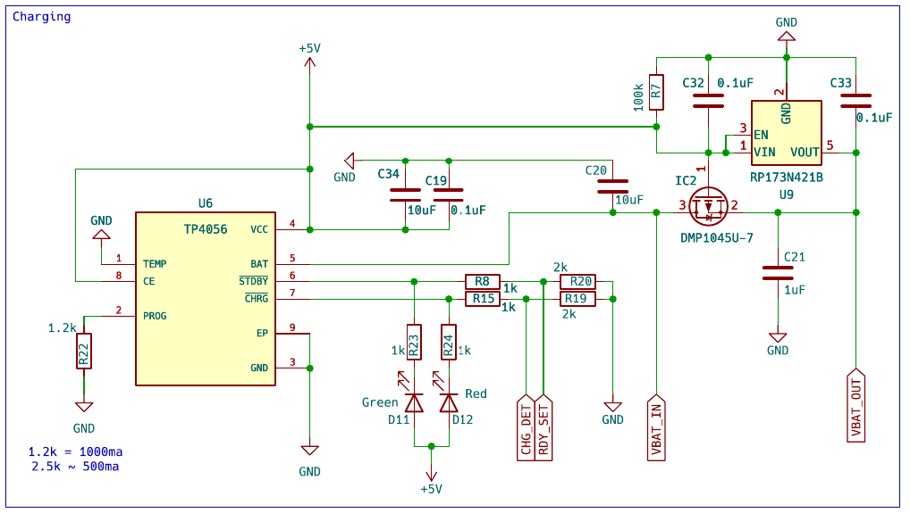
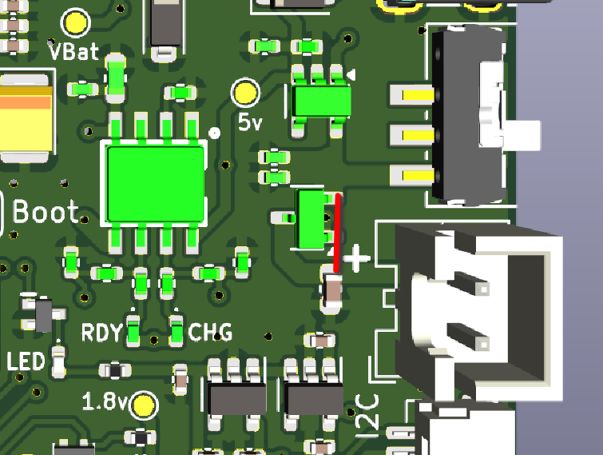

# Tracker III.2
A BG96 and NRF52840 based GPS tracker

The history for this design can be found on a series of posts: [Tracking running](https://blog.ivor.org/2020/10/tracking-running-part-2.html) [RAK track](https://blog.ivor.org/2022/02/between-rak-and-sweet-place.html) [Tracker two](https://blog.ivor.org/2022/03/trackertwo.html), the details for this build are at [T3 Rise of the machines](https://blog.ivor.org/2024/08/t3-rise-of-machines.html)

Latest schematic [here](schematic.pdf).

Main functional features on the board are highlighted here.

### USB connection
I changed to a USB-C connector, and the USB connection can be switched between the NRF and BG96 chips, most of the time the NRF will be useful but if you need/want to diagnose the GPS data directly or update the BG96 firmware then you can move jumpers.

### Charger
I changed the charger design to include a load share design and a power regulator with a "reverse current" protection shown on the schematic:

When USB power is applied and the TP4056 starts charging, the MOSFET IC2 detaches the battery from the load and the power to the board is taken from the regulator U9.
When the USB power is removed and the battery (VBAT_IN) is the source then the MOSFET lets the power run through to VBAT_OUT directly, the reverse current protection on U9 prevents it returning to the 5v line.

### Regulators
The board internally runs all devices and data lines at 1.8v but level shifts these for external interfacing to 3.3v.

### IO Ports
Two qwiik compatible connectors provide 3.3v I2C and general purpose IO lines.

### Fuel Gauge
A MAX17048 fuel gauge chip is included to give an accurate and reliable power level info.

### Flash
Onboard 8Gb Flash module, I'm still on the fence whether to replace this with an SDcard slot instead.

### Temp & Humidity
Since I had a space on the board and it was next to the I2C lines, I changed my mind and decided to include a SHTC3 temperature and humidity chip. I found the temperature in tracker2 wasn't particularly useful so instead used an external ANT sensor, but the humidity was handy.

### Button connectors
Four GPIO lines are exposed alongside a ground line to make it easy to add a set of buttons.

# Render
The render view in KiCad is handy to check the layout looks sane and makes sense:

A picture of a nearly final prototype up and running:

## Build Notes
The build is a single sided board so quite straightforward to manufacture, although there are a few options to make it simpler.

Firstly optional parts, the fuel gauge can be omitted just skip U4 and C17, the pull-ups are still needed though for working I2C.
Similarly the temperature sensor can be skipped, omit U10 and C35.
The flash isn't absolutely necessary, but it's an easy to solder part and it's really quite useful.
The entire charge circuit can be omitted if preferred and the battery charged externally, but again these aren't complicated parts to solder. 

Just skip the parts marked in green and connect VBAT_IN to VBAT_OUT (in red)

### Difficult parts
Next up, difficult parts to solder.... the fuel gauge U4, and the ESD's U2 and U5 have very close contacts, these can bridge even with hotplate soldering so need inspecting although the pins can be easily fixed with the touch of a fine soldering iron since the pins are visible at the edges. Similary the USB-C socket can be trouble and needs inspection.

### Soldering
It's a good idea to use low temperature solder since a full temperature reflow will also reflow the internals of the BG96 and Holyiot modules. Another possibility would be to get the board manufactured by someone else (or flowed yourself) in two stages, initially just all the components *except* the two modules using standard temperature solder. Then after the board is manufactured, apply low temp paste for the BG96 and Holyiot for a second low-temp reflow.
